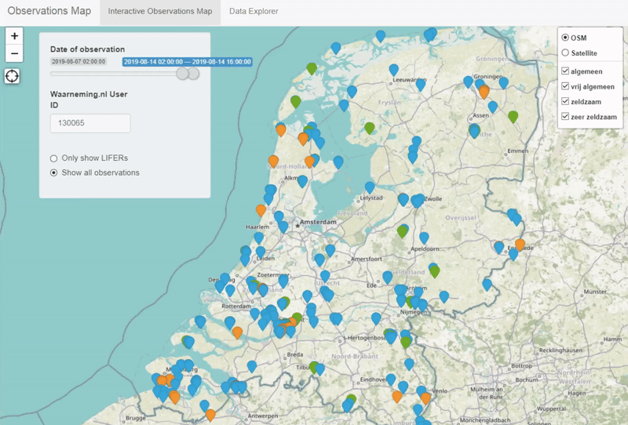

# bird_observations
This webapp is created to give a chronological overview of observations users have made of birds in the Netherlands using the platform waarnemingen.nl

Check out the interactive map here: https://fredderks.shinyapps.io/bird_observations/

You can attach your waarneming.nl user ID to allow for comparison with your life list. To do this go to; waarneming.nl >> USER >> Profile, then copy the number from the url e.g. https://waarneming.nl/users/130065/ and paste into the input box in the app, wait a few seconds and it will filter the observations on your LIFER species.